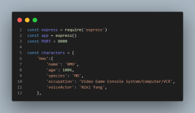

# Adventure Time Main Characters Api


This is an API that holds data relating to the main characters of the Adventure Time tv series.


## Table of contents

- [Overview](#overview)
  - [Screenshot](#screenshot)
  - [Links](#links)
- [My process](#my-process)
  - [Built with](#built-with)
  - [What I learned](#what-i-learned)
  - [Continued development](#continued-development)
  - [Useful resources](#useful-resources)
- [Author](#author)

## Overview

### Screenshot



### Links

- Repository URL: [Here](https://github.com/codewithjazzy/adventure-time-main-characters-api)
- Live Site URL: [Here](https://adventure-time-api.cyclic.app)


## My process

<!--- ### Running the Project Locally
To run this project locally it's necessary to:
1. **Install Node.js**.

   You can download it from the official [Node.js website](https://nodejs.org/).
2. In your terminal, run the following command:

   ```bash
   npm install
   ```
3. **Run the project**.
    ```bash
   node server.js
   ```
   This command will start a local development server, and you can access the project in your web browser at `http://localhost:8000`. --->


### Built with

<p float="left">
  
   
  
  
  
</p>


### What I learned

The motivation behind this project was to practice what I had learned about CRUD API methods.  
I learned:
- How to install node modules
- How to install the Express dependency
- Express routing methods, paths, handlers, and parameters
- How to use Postman to test my API locally


### Continued development

This is always a WIP and with time, I'd like to work on a few more ideas:

- Add HTML for user input
- Add Javascript event listeners for user input based search results
- Add CSS for flair


### Useful resources

- [Adventure Time Wiki](https://adventuretime.fandom.com/wiki/Adventure_Time_Wiki) - An unofficial collaborative database about the Cartoon Network series Adventure Time and its fictional universe.
- [Postman API Platform](https://www.postman.com/)  - Simplified API usage with desktop agent

## Author
- LinkedIn - [@CodeWithJazzy](www.linkedin.com/in/codewithjazzy)
- Twitter - [@CodeWithJazzy](https://twitter.com/CodeWithJazzy)
